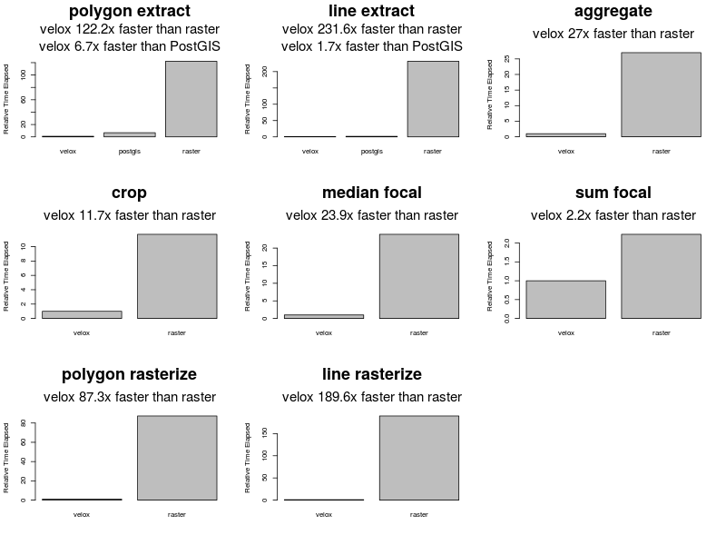

2018-02-27 - Basel, Switzerland - Using earth observation (EO) data products for environmental exposure assessment

Note: if you don't use [git lfs](https://git-lfs.github.com/), the data for this repository is also on [Dropbox](https://www.dropbox.com/sh/4musvei5968pix8/AABbWfJ7ORNEA_eOIMhliM4Ha?dl=0)bWfJ7ORNEA_eOIMhliM4Ha?dl=0)

---

## Introduction

### About me

* Ian Hough, PhD student with Itai Kloog and Johanna Lepeule
* High-resolution models of air temperature and particulate air pollution across France
* Effects on birth outcomes

### Topic

* Introduction to raster data processing in R.

### Assumptions

* Everyone here has used R before
* Some may have limited experience working with spatial data

### Outline

1. What is raster data?
2. The `raster` package
3. The `velox` package
4. Further resources

---

## 1. What is raster data?

* One of two main ways to represent spatial data in a GIS (raster + vector)
* Raster = regular grid of cells (pixels) with value for each cell
* Digital photo with resolution, extent, and coordinate reference system (CRS)
* Good for spatially continuous data (e.g. elevation, NDVI, PM, temperature)
* May have multiple layers (e.g. one per satellite spectral band)

---

## 2. The `raster` package

### Load the package

```{r}
library(magrittr) # chain operations with %>% to increase code readability
library(sp)
library(rgdal)
library(raster)
```

`sp`

* Classes and methods for spatial data
* Required by `raster`
* https://cran.r-project.org/package=sp

`rgdal`

* Support for many spatial data formats (e.g. GeoTIFF, shapefile)
* If installing from source, [GDAL](http://www.gdal.org/) and [PROJ.4](http://proj4.org/) must be present
* https://cran.r-project.org/package=rgdal

`raster`

* Read, write, manipulate, analyze, and model gridded spatial data
* https://cran.r-project.org/package=raster
* Watch out for masking! `raster::extract` vs `magrittr::extract` vs `dplyr::extract`

---

### Load raster data

Example data: 2008 MODIS Terra monthly composite 1 km NDVI [(MOD13A3)](https://lpdaac.usgs.gov/dataset_discovery/modis/modis_products_table/mod13a3_v006). Already converted from HDF4 (`.hdf`) to GeoTIFF (`.tif`) and stacked all months in one file.

#### A single band

```{r}
# RasterLayer = single layer
ndvi <- raster("data/ndvi_2008_h17v04.tif", band = 7) # July
ndvi
```

---

Accessor functions:

* band - `bandnr`, `nbands`
* dimensions - `dim`, `nrow`, `ncol`, `ncell`, `nlayers`
* resolution - `res`
* extent - `extent`
* crs - `crs` or `projection`
* source - `filename`, `inMemory`
* names - `names`
* values - `cellStats`
* `coordinates`

---

Watch out for:

* Missing CRS - some data formats do not save it or save it in a separate file
* Inaccurate min / max values - use `summary` or `cellStats` to get actual ranges

---

#### Multiple bands

```{r}
# RasterStack = any number of layers in one or more files and in memory
stack("data/ndvi_2008_h17v04.tif", bands = c(1, 7))

# RasterBrick = all the layers in a single file or any number of layers in memory
brick("data/ndvi_2008_h17v04.tif")
```

---

#### Summary

`RasterLayer`

* A single layer in a file or in memory

`RasterStack`

* Most flexible: any number of layers in any combination of files and memory

`RasterBrick`

* Most performant: all layers in a file or any number of layers in memory

---

### Mapping data

Map composite NDVI for Jauary 2008. The black border delimits the extent.

```{r}
ndvi <- brick("data/ndvi_2008_h17v04.tif")
plot(ndvi[[1]], axes = FALSE, box = FALSE)
plot(extent(ndvi), add = TRUE)
```

Colored areas = western France, northern Portugal and Spain. White areas = Atlantic (`NA` because NDVI not calculated over ocean).

### Accessing values

Use standard R indexing or accessor functions.

```{r}
names(ndvi) <- 1:12
names(ndvi)
```

Layer names can't start with a numeral (or contain "-").

```{r}
names(ndvi) <- tolower(month.abb)
names(ndvi)
```

---

Access layers by name or index

```{r}
# Identical
jan <- ndvi$jan
jan <- ndvi[["jan"]] # or ndvi[[1]]
jan <- subset(ndvi, "jan") # or subset(ndvi, 1)
jan
```

---

Look at the top left or bottom right corner.

```{r}
head(jan, 5, 5) # top left, first 5 rows and first 5 columns
tail(jan, 5, 5) # bottom right, last 5 rows and last 5 columns
```

---

Access values by row and col. Cells numbered from top left corner to top right corner, then from left to right along second row, and so on. Also access by cell index.

```{r}
# Identical
vals <- jan[1001, 1000:1009]
vals <- getValuesBlock(jan, row = 1001, nrows = 1, col = 1000, ncol = 10)
vals <- jan[1201000:1201009]
vals <- extract(jan, 1201000:1201009)
vals
```

All values with `jan[]` or `values(jan)`. Helper functions to convert between coordinates, row/col, and cell index: `cellFromRowCol`, `rowColFromCell`, `xyFromCell`, `cellFromXY`.

---

### Manipulating data

Example workflow: seasonal NDVI in four departments in southwestern France.

#### Load a shapefile

```{r}
depts <- shapefile("data/sw_france.shp")
depts
```

---

#### Transform (project)

Always transform vector data to match raster (transforming raster data will alter values). But If you must, transform raster data with `projectRaster`.

```{r echo = FALSE}
# Example raster
r <- crop(jan, extent(jan, 1001, 1005, 1001, 1005))
values(r) <- 1:ncell(r)

# Plot with cell borders
cells <- as(r, "SpatialPolygons")
plot(r, axes = FALSE, box = FALSE)
plot(cells, add = TRUE)

# Transform
r_new <- projectRaster(r, crs = crs(depts)) %>% trim(values = NA)
cells <- spTransform(cells, crs(depts))

# Plot with old cell borders
plot(cells)
plot(r_new, axes = FALSE, box = FALSE, add = TRUE)
plot(cells, add = TRUE)

# View values
print("Original values:")
as.matrix(r)
print("After projecting:")
as.matrix(r_new) %>% round(2)

# Cleanup
rm(r, r_new, cells)
```

---

```{r}
# Project departments to match NDVI data
depts <- spTransform(depts, projection(ndvi))
plot(jan)
plot(depts, add = TRUE)
```

#### Mosaic


```{r}
# Load more data
ndvi2 <- brick("data/ndvi_2008_h18v04.tif")

# Check alignment (must have same CRS, origin, and resolution)
compareRaster(ndvi, ndvi2, crs = TRUE, orig = TRUE, res = TRUE, extent = FALSE, rowcol = FALSE)

# Mosaic the rasters
# Could also use merge(ndvi, ndvi2)
ndvi <- mosaic(ndvi, ndvi2, fun = mean) #, filename = "ndvi_2008.tif")

# Set names and plot
names(ndvi) <- tolower(month.abb)
plot(ndvi$jan)
plot(depts, add = TRUE)
```

---

#### Crop

```{r}
ndvi <- crop(ndvi, depts, snap = "out")
plot(ndvi$jan)
plot(depts, add = TRUE)
```

---

#### Save to disk

```{r}
writeRaster(ndvi, "data/ndvi_2008_crop.tif", overwrite = TRUE)
```

---

#### Calculate

```{r}
# Range of NDVI
ndvi_diff <- min(ndvi, na.rm = TRUE) - max(ndvi, na.rm = TRUE)
plot(ndvi_diff)
plot(depts, add = T)
```

---

```{r}
# Seasonal max NDVI
seasonal <- stackApply(ndvi, c(1, 1, 1, 2, 2, 2, 3, 3, 3, 4, 4, 4), fun = max)
names(seasonal) <- c("q1_max", "q2_max", "q3_max", "q4_max")
plot(seasonal)
```

---

For complex formulas on large files, use `calc` to calculate by chunk. Specify a filename to save result directly to disk. Be sure to construct the formula so that it never needs access to all values.

---

#### Extract by polygon

```{r}
# Mean for each department of seasonal max NDVI; df = TRUE returns data.frame
extract(seasonal, depts, fun = mean, na.rm = TRUE, df = TRUE)
```

---

Cells are included if centroid is contained by polygon. If polygons are small (relative to cells), consider using

* `small = TRUE`: if polygon contains no cell centroids, return value of cell that contains polygon centroid
* `weights = TRUE`: weight cells according to portion of cell's area contained by polygon
* `normalizeWeights = TRUE`: adjust weights so that they sum to one for each polygon

Or use `disaggregate` to artificially increase raster resolution - may be faster than calculating weights.

---

#### Extract by points

Much faster than extracting by polygon.

```{r}
# Make some points
pts <- spsample(depts, n = 100, type = "random")
plot(ndvi_diff)
plot(depts, add = T)
plot(pts, add = T, pch = 19)

# Add seasonal max NDVI to the points
pts <- extract(seasonal, pts, sp = TRUE)
pts
```

---

Value is taken from cell that contains point. Can also use:

* `method = "bilinear"`: interpolate from four nearest cells
* `buffer = 5000`: include all cells whose centroid is within 5000 units of the each point

---

#### Parallel extraction

Useful if you need to extract values for many points or polygons.

```{r}
library(parallel)
if (Sys.info()["sysname"] == "Windows") {
  ncores <- 1
} else {
  ncores <- detectCores()
}
splits <- split(depts, 1:4)
mclapply(splits, function(splt, r) {
  extract(r, splt, fun = mean, na.rm = TRUE, df = TRUE)
}, mc.cores = ncores, r = seasonal) %>% do.call(rbind, .)
```

Watch out for memory use - would be better if `mclapply` was passed a cropped raster for each split.

---

#### Interpolation

```{r}
library(gstat)

# Inverse distance weighted interpolation based on the points
idw <-
  gstat(formula = q3_max ~ 1, locations = pts) %>%
  interpolate(seasonal, .)
plot(idw)
plot(depts, add = T)
```

---

#### Prediction

```{r}
# Predict fall max NDVI from summer max NDVI
predicted <-
  lm(q4_max ~ q3_max, data = pts) %>%
  predict(seasonal, .)
plot(predicted)
plot(depts, add = T)
```

## 3. The `velox` package

`velox`

* c++ accelerated raster manipulation
* https://cran.r-project.org/package=velox

```{r}
library(velox)

# raster::extract
system.time(
  extract(seasonal, depts, fun = mean, na.rm = TRUE)
)

# velox::extract
fun <- function(x) { mean(x, na.rm = TRUE) }
system.time(
  velox(seasonal)$extract(depts, fun)
)
```

---

Benchmarks from https://hunzikp.github.io/velox/benchmark.html

```{r, echo = FALSE}

```

---

Pros:

* Very fast for extract by polygons

Cons:

* Data must fit in memory
* Creating a `VeloxRaster` takes some time - only worthwhile if many polygons
* Limited help, but there is a [manual](https://cran.r-project.org/package=velox)

**Warning:** methods that modify a `VeloxRaster` (e.g. `VeloxRaster$crop` or `VeloxRaster$aggregate`) *do not return a copy* - use `VeloxRaster$copy` if you want one.

---

## 4. Further resources

* Vignettes and manuals for [raster](https://cran.r-project.org/package=raster) and [velox](https://cran.r-project.org/package=velox) on CRAN
* [R Spatial](http://www.rspatial.org/) introduction to spatial data manipulation and analysis
* Velox [website](https://hunzikp.github.io/velox/index.html)
* [StackExchange](https://stackexchange.com/)
* This presentation: [github.com/ihough/2018-02_raster_intro](https://github.com/ihough/2018-02_raster_intro)
